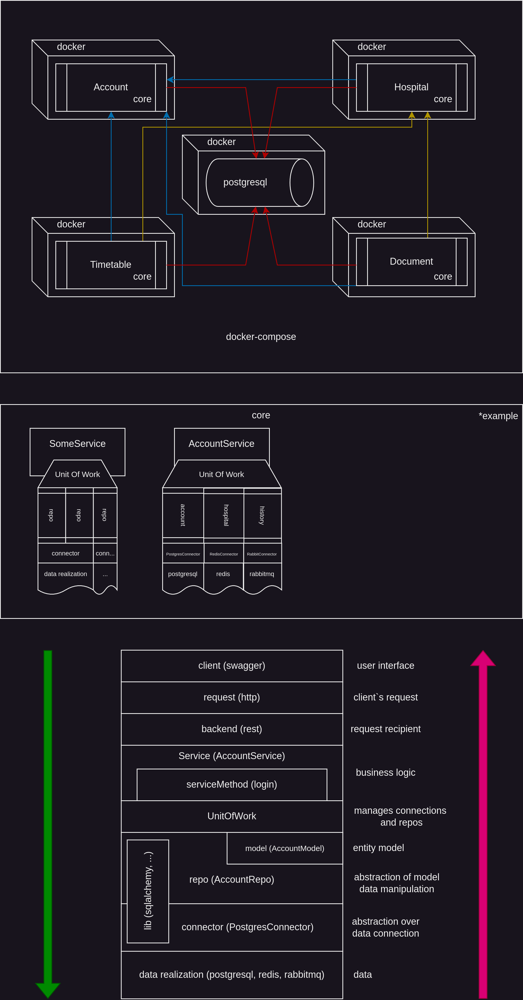

# SimbirHealth

## Запуск
`docker-composer up -d`

## Основное задание
1. Account URL: http://localhost:8011/docs
2. Hospital URL: http://localhost:8021/docs
3. Timetable URL: http://localhost:8031/docs
4. Document URL: http://localhost:8041/docs

### Хочу немного рассказать про архитектуру

Микросервисы выступают лишь интерфейсом доступа к бизнес-логике. В каждом микросервисе есть пакет `core`, где описана основная бизнес-логика (сервисы) и необходимые инструменты.

1. *Репозитории* \
    Сервисы взаимодействуют с репозиториями. Репозиторий — это набор методов для работы с данными и моделями. Например, `AccountRepo` - это репозиторий, в котором описаны методы для работы с аккаунтами. Репозитории работают с библиотеками, например `sqlalchemy`.

2. *Коннекторы* \
    Для работы репозиториев нужны **коннекторы**. Коннектор отвечает за открытие сессии, передачу этой сессии репозиторию, а затем за её корректное закрытие. Один коннектор может обслуживать несколько репозиториев.

3. *Unit of Work* \
    Репозитории и коннекторы объединяются через `unit of work`. Однако `unit of work` не владеет репозиториями и коннекторами напрямую. Это, конструктор, который получает их на вход.  
    При инициализации он создаёт экземпляры коннекторов и передаёт сессии этих коннекторов в репозитории, если они им необходимы.  
    `Unit of work` управляет жизненным циклом сессий - он закрывает все сессии коннекторов при завершении своей работы. Таким образом, `unit of work` можно представить как основную сессию, внутри которой находятся репозитории и коннекторы с собственными сессиями.

4. *Сервисы* \
    Сами сервисы получают на вход `unit of work`, и в своих методах они работают с репозиториями через него.  
    Чтобы гарантировать, что все необходимые репозитории присутствуют в `unit of work` при вызове метода сервиса, был добавлен декоратор `@uowaccess`. Он проверяет, что в `unit of work` есть все нужные для работы репозитории.

Чтобы вся эта схема работала, нужно настроить зависимости — то есть определить, какие репозитории и коннекторы будут использоваться.  
Наша архитектура гибкая, и позволяет писать кастомные репозитории и коннекторы. **То есть, можно заменить работу с базой данных на работу с `redis`, не изменяя бизнес-логику, а лишь создав новые реализации репозиториев и коннекторов в микросервисе.**

